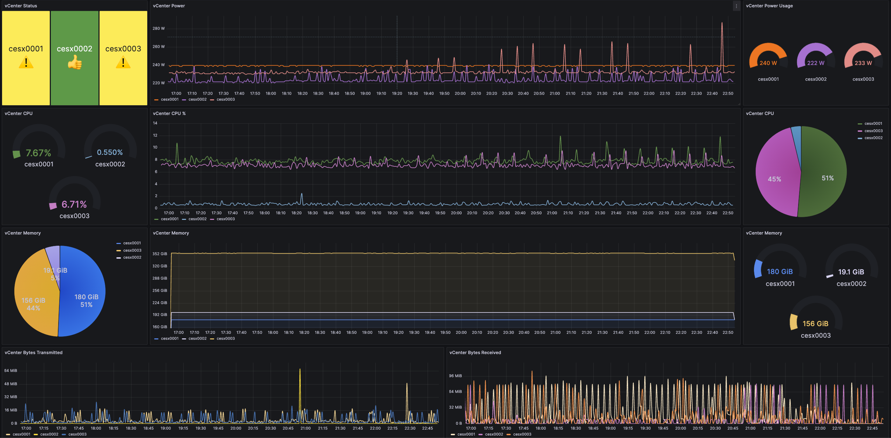

# Multi-Site Cloud Monitoring Overview

This repo contains documentation for setting up a robust and scalable Zabbix/Grafana
monitoring environment. This stack utlilzes agent polling, SNMP traps, as well as Shell,
Perl, and Python scripting to provide live status updates of devices across multiple sites.

---

## Example

Grafana dashboard monitoring a Zabbix server. Many different types of both virtual and
physical hosts can be monitored. The combination of Zabbix and Grafana can be both flexible and powerful.

---

---

## Zabbix

From a high level, Zabbix is an aggregator for real time metrics. It is a comprehensive open-source
solution that can monitor a wide range of IT components, including servers, network devices, virtual machines,
applications, and more. It collects data on various performance metrics such as CPU utilization, memory usage,
disk space, network traffic, and custom parameters.

### Metrics

There are 3 main ways to obtain metrics from hosts:

- Agent polling
- SNMP traps
- Scripting & API

#### Agent polling

Agents installed on servers or devices send data to the Zabbix server at predefined intervals.
This method is reliable for collecting a wide range of metrics from system performance to application states.

#### SNMP traps

Traps enable us to see any significant events occuring in the hardware stack as it happens. Using
them in tandem with polling gives extensive monitoring coverage for important items such as
physical network links and BGP sessions.

#### Scripting & API

Zabbix's flexibility is further extended through the use of custom scripts and APIs.
These tools allow for the integration of third-party applications and services into the monitoring
framework. Scripts, often written in Shell, Perl, or Python, enable the collection of specialized metrics and
the automation of certain monitoring tasks.

### Proxies

Zabbix proxies play a crucial role in the Zabbix monitoring architecture, particularly in large, distributed, or
complex network environments. They are intermediary servers that collect performance and availability data from
monitored devices and forward this information to the Zabbix server. The use of proxies can significantly enhance
the scalability, efficiency, and reliability of the monitoring system.

## Grafana

Grafana, a platform for analytics and interactive visualization, is often used alongside Zabbix to create more
dynamic and visually appealing representations of data. These dashboards provide a clearer, more accessible view
of the metrics collected by Zabbix. Common dashboard categories include:

- Network
- Power
- Systems
- Software
