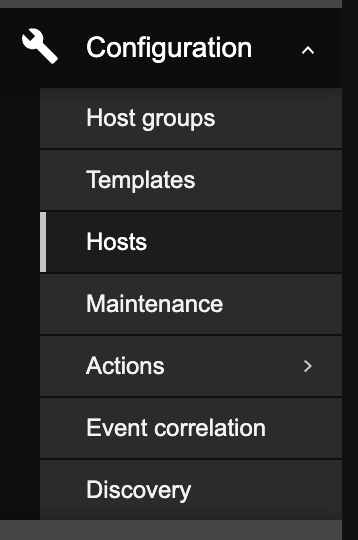

# Hosts

In the Inventory → Hosts section inventory data of hosts are displayed.

You can filter the hosts by host group(s) and by any inventory field to display only the
hosts you are interested in.

## Create Host

Log in to the appropriate Zabbix instance.

On the left side menu go to Configuration --> Hosts.

In the top right corner click create host, below is an example of a switch. Make sure to set up
any new hosts with appropriate configurations.

### Configure Name

Please make sure to follow naming conventions.

### Configure Templates

The example above shows an Arista, and SNMP Trap template, if you are adding another
Arista switch, use the same options. If you are adding another type of device,
such as a server, then add appropriate templates for the device you are adding.

### Configure Groups

Follow the same guidelines for groups that were provided for templates.

### Configure Interfaces

The example below shows a single interface configured but you can add more if needed. Place the IP
of the host here. Make sure the SNMP version is set to v2 and the SNMP community is sest to
`{$SNMP_COMMUNITY}`.

If you are using SNMP you will need to add the community string as well. In the host
configuration window click the 'Macros' tab at the top. Use the example below and set your host up
the exact same.

