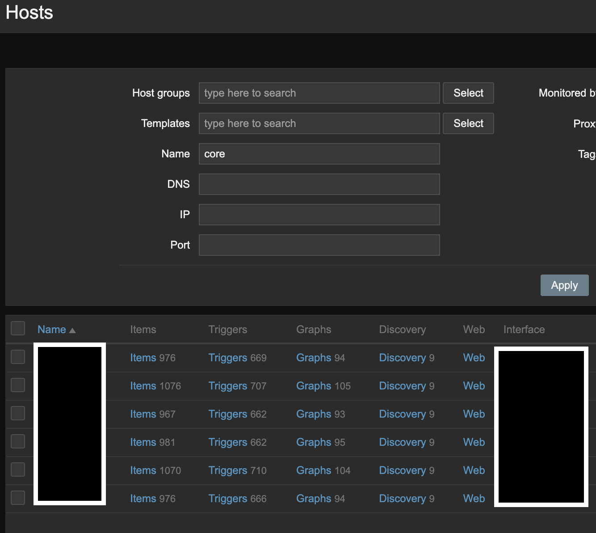

# Items

An item is an individual metric.

Items are used for collecting data. Once you have configured a host, you must add items
to get actual data. One way of quickly adding many items is to attach one of the predefined
templates to a host. However, for optimized system performance, you may need to fine-tune
the templates to have as many items and as frequent monitoring as necessary.

## Create Item

Log in to the appropriate Zabbix instance.

On the left side menu go to Configuration --> Hosts (or Templates).

You will see a screen that looks similar to below. Click the _item_ hyperlink next to
the host you want to add an item to.

In the top right corner click create item like you do for a new host, below is an
example of an SNMP Trap item on a switch.

## Considerations

There are multiple ways to set up items in Zabbix. The example above shows a specific use
case for the item and only sets up the item on that individual host. Most of the time you
will want to create a template and add items to it. Then you are able to use the same items
across dozens of hosts, greatly reducing time for creating and adjusting items.
