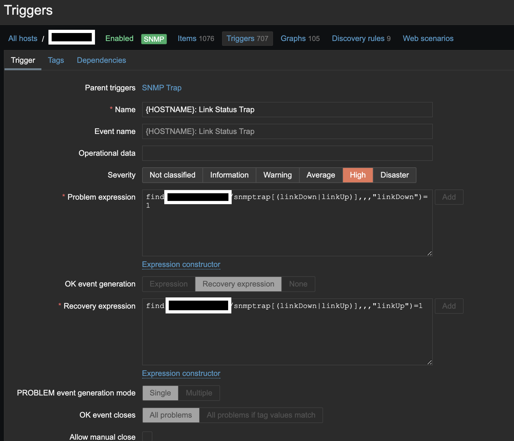

# Triggers

Triggers are logical expressions that "evaluate" data gathered by items and represent
the current system state.

While items are used to gather system data, it is highly impractical to follow these
data all the time waiting for a condition that is alarming or deserves attention. The
job of "evaluating" data can be left to trigger expressions.

Trigger expressions allow to define a threshold of what state of data is "acceptable".
Therefore, should the incoming data surpass the acceptable state, a trigger is
"fired" - or changes its status to PROBLEM.

## Create Trigger

Log in to the appropriate Zabbix instance.

On the left side menu go to Configuration --> Hosts (or Templates).

You will see a screen that looks similar to below. Click the _trigger_ hyperlink next to
the item you want to add a trigger to.

In the top right corner click create item like you do for a new host, below is an
example of an SNMP Trap item on a switch.

## Considerations

When setting up triggers it is best to use templates as they are much easier to manage.
Regular Expressions are used to grab specific data from item metrics and evaluate that data. Then
_trigger actions_ are used to notify admins via their preffered media.
